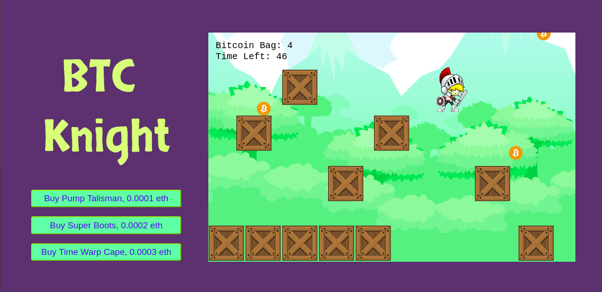

# ethereum-game
An game built on ethereum using erc1155 standard and Phaser library.

To play the game:
1. Install metamask browser extension and switch to Ropsten test network.
2. Go to samanshk.github.io/btcknight
3. Enjoy the game!
